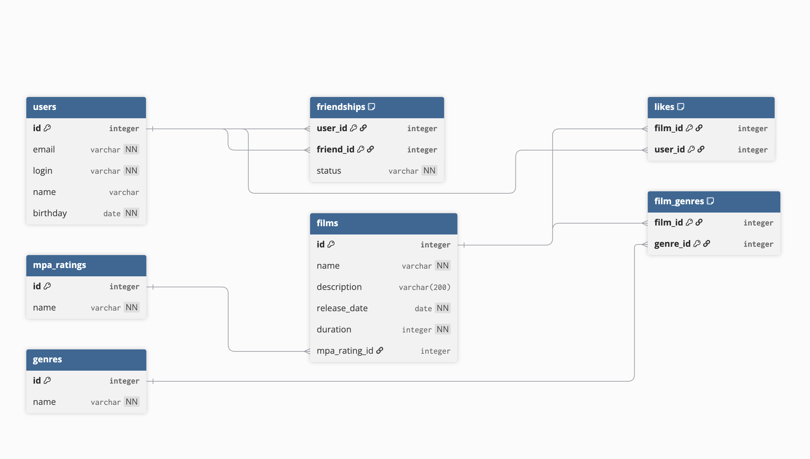

# Filmorate

## ER-диаграмма



## Описание

База данных для сервиса Filmorate. Хранит:
- пользователей,
- фильмы с жанрами и рейтингом MPA,
- дружбу между пользователями со статусом,
- лайки фильмов.

## Таблицы

| Таблица | Назначение |
|---------|-----------|
| `users` | Пользователи |
| `films` | Фильмы |
| `mpa_ratings` | Справочник рейтингов MPA |
| `genres` | Справочник жанров |
| `film_genres` | Many-to-many: фильмы ↔ жанры |
| `friendships` | Дружба со статусом |
| `likes` | Лайки фильмов |

## Примеры запросов

### 1. Получить всех пользователей
```sql
SELECT id, email, login, name, birthday
FROM users
ORDER BY id;
```

### 2. Получить все фильмы с рейтингом
```sql
SELECT f.id, f.name, m.name AS mpa
FROM films f
JOIN mpa_ratings m ON f.mpa_rating_id = m.id;
```

### 3. Топ-10 фильмов по лайкам
```sql
SELECT f.id, f.name, COUNT(l.user_id) AS likes_count
FROM films f
LEFT JOIN likes l ON f.id = l.film_id
GROUP BY f.id, f.name
ORDER BY likes_count DESC
LIMIT 10;
```

### 4. Жанры конкретного фильма
```sql
SELECT g.name
FROM genres g
JOIN film_genres fg ON g.id = fg.genre_id
WHERE fg.film_id = 1;
```

### 5. Друзья пользователя (только подтверждённые)
```sql
SELECT u.*
FROM users u
JOIN friendships fr ON u.id = fr.friend_id
WHERE fr.user_id = 1 AND fr.status = 'CONFIRMED';
```

### 6. Общие друзья двух пользователей
```sql
SELECT u.*
FROM users u
JOIN friendships f1 ON u.id = f1.friend_id
JOIN friendships f2 ON u.id = f2.friend_id
WHERE f1.user_id = 1 AND f2.user_id = 2
  AND f1.status = 'CONFIRMED'
  AND f2.status = 'CONFIRMED';
```
